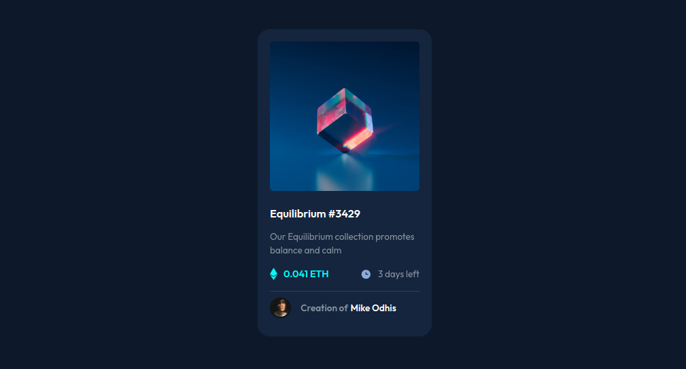

# Frontend Mentor - NFT preview card component solution

This is my solution to the [NFT preview card component](https://www.frontendmentor.io/challenges/nft-preview-card-component-SbdUL_w0U).

## Table of contents

- [Overview](#overview)
  - [The challenge](#the-challenge)
  - [Screenshot](#screenshot)
  - [Links](#links)
  - [Challenges](#challenges)
- [My process](#my-process)
  - [Built with](#built-with)
- [Author](#author)

## Overview

### The challenge

Users should be able to:

- View the optimal layout depending on their device's screen size
- See hover and focus states for interactive elements

For this project I practiced my skills on CSS custom properties and the mobile-first approach. I also wanted to challenge my Vanilla CSS knowledge, without using any frameworks or libraries.

### Screenshot

A desktop preview of my solution

### Links

- Solution URL: [Frontend Mentor](https://www.frontendmentor.io/solutions/responsive-product-preview-card-component-using-css-grid-IV0I5Utrn5)
- Live Site URL: [Live Site](https://poulpe-ppc.netlify.app/)

### Challenges
This was my first time starting with a mobile-first design approach. While it tooks some getting used to, it made working media queries less hectic.

## My process

### Built with

- Mobile-first workflow
- Semantic HTML5 markup
- CSS custom properties
- Flexbox
- CSS Grid

## Author

- Frontend Mentor - [@MikeOdhiambo](https://www.frontendmentor.io/profile/MikeOdhiambo)
- Twitter - [@__poulpe](https://twitter.com/__poulpe)

