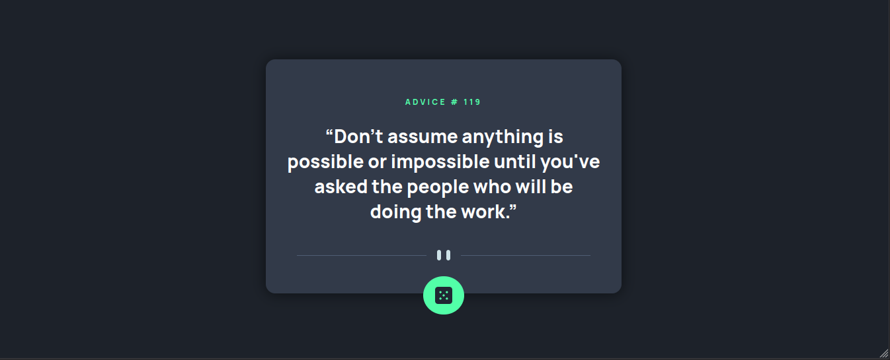

# Frontend Mentor - Advice generator app solution

My solution to the [Advice generator app challenge on Frontend Mentor](https://www.frontendmentor.io/challenges/advice-generator-app-QdUG-13db).

The task is to create a card with advice generated from [Advice Slip API](https://api.adviceslip.com).

## Table of contents

- [Overview](#overview)
  - [The challenge](#the-challenge)
  - [Screenshot](#screenshot)
  - [Links](#links)
- [My process](#my-process)
  - [Built with](#built-with)
  - [Continued development](#continued-development)
- [Author](#author)

## Overview

### The challenge

Users should be able to:

- View the optimal layout for the app depending on their device's screen size
- See hover states for all interactive elements on the page
- Generate a new piece of advice by clicking the dice icon

### Screenshot

A desktop screenshot of my solution.

### Links

- Solution URL: [Frontend Mentor Solution](https://www.frontendmentor.io/solutions/advice-generator-app-vWII-3BMV8)
- Live Site URL: [Live Site](https://poulpe-advgen.netlify.app/)

## My process

### Built with

- Mobile-first workflow
- Semantic HTML5 markup
- CSS custom properties
- Flexbox
- [Styled Components](https://styled-components.com/) - For styles

### Continued development

I found that I needed to revisit and practice more working with background images and CSS shadows.

## Author

- Frontend Mentor - [@MikeOdhiambo](https://www.frontendmentor.io/profile/MikeOdhiambo)
- Twitter - [@__poulpe](https://twitter.com/__poulpe)
